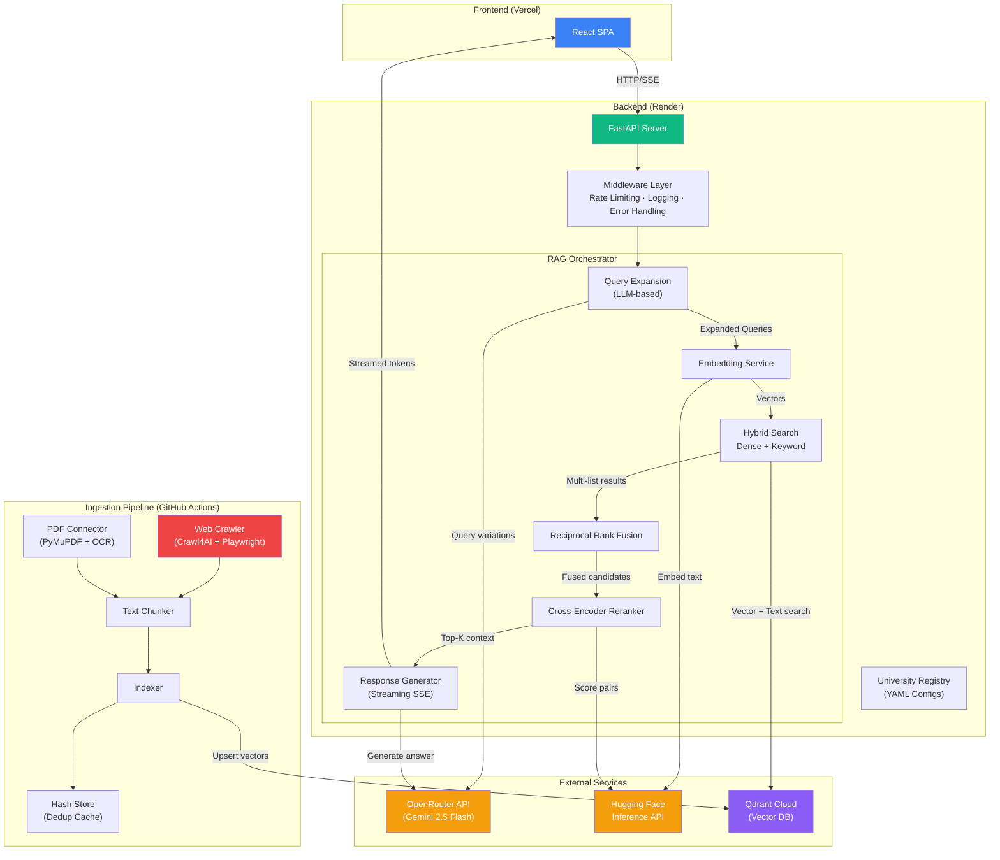
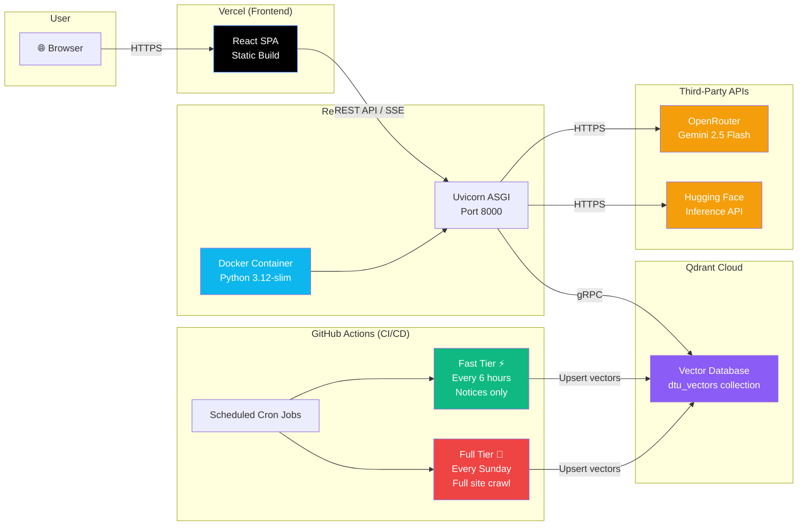

<p align="center">
  
</p>

<h1 align="center">CampusMind AI</h1>

<p align="center">
  <strong>Multi-Tenant RAG Knowledge Platform for Universities</strong>
</p>

<p align="center">
  An intelligent AI chatbot that crawls, indexes, and answers questions about university information — admissions, departments, placements, notices, syllabi, and more — using a production-grade Retrieval-Augmented Generation (RAG) pipeline.
</p>

<p align="center">
  <a href="#features">Features</a> •
  <a href="#tech-stack">Tech Stack</a> •
  <a href="#architecture">Architecture</a> •
  <a href="#deployment-architecture">Deployment</a> •
  <a href="#getting-started">Getting Started</a> •
  <a href="#project-structure">Project Structure</a> •
  <a href="#environment-variables">Environment Variables</a> •
  <a href="#license">License</a>
</p>

---

## Features

- 🤖 **Conversational AI** — Ask natural language questions and get accurate, source-cited answers
- 🔍 **Advanced RAG Pipeline** — Query Expansion → Hybrid Search → Reciprocal Rank Fusion → Cross-Encoder Reranking
- 🌐 **Multi-Tenant Architecture** — Support multiple universities from a single deployment via YAML configs
- 📄 **PDF & Web Crawling** — Automatically crawls university websites and extracts text from PDFs (with OCR support)
- ⚡ **Streaming Responses** — Real-time token-by-token response streaming via Server-Sent Events (SSE)
- 🔄 **Incremental Indexing** — GitHub Actions cron jobs crawl and re-index content on a schedule, skipping unchanged documents
- 🛡️ **Rate Limiting & Middleware** — Built-in request logging, rate limiting (30 req/min), and global error handling
- 🎨 **Modern UI** — Glassmorphism design with smooth animations, dark theme, and mobile-responsive layout

---

## Tech Stack

### Frontend
| Technology | Purpose |
|---|---|
| **React 19** | UI framework |
| **Vite 8** | Build tool & dev server |
| **Tailwind CSS 4** | Utility-first styling |
| **Framer Motion** | Animations & transitions |
| **React Router v7** | Client-side routing |
| **React Markdown** | Markdown rendering with GFM support |
| **Lucide React** | Icon library |

### Backend
| Technology | Purpose |
|---|---|
| **FastAPI** | High-performance async API framework |
| **Uvicorn** | ASGI server |
| **Pydantic v2** | Data validation & settings |
| **HTTPX** | Async HTTP client (for OpenRouter LLM calls) |
| **Hugging Face Hub** | Inference API client for embeddings & reranking |
| **SlowAPI** | Rate limiting middleware |
| **PyYAML** | University configuration parsing |

### AI / ML
| Technology | Purpose |
|---|---|
| **Qdrant** | Vector database (cloud-hosted) |
| **Sentence-Transformers** | `paraphrase-multilingual-MiniLM-L12-v2` for embeddings |
| **Cross-Encoder** | `ms-marco-MiniLM-L-6-v2` for reranking |
| **OpenRouter API** | LLM gateway (Gemini 2.5 Flash for generation) |

### Ingestion Pipeline
| Technology | Purpose |
|---|---|
| **Crawl4AI** | Async web crawler with Playwright |
| **PyMuPDF / pdfplumber** | PDF text extraction |
| **Pytesseract** | OCR for scanned PDFs (English + Hindi) |
| **BeautifulSoup4** | HTML parsing |
| **Pillow** | Image processing for OCR |

### Infrastructure
| Technology | Purpose |
|---|---|
| **Render** | Backend hosting (Docker) |
| **Vercel** | Frontend hosting (static SPA) |
| **Qdrant Cloud** | Managed vector database |
| **GitHub Actions** | CI/CD for scheduled data ingestion |
| **Docker / Docker Compose** | Local development environment |

---

## Architecture

### High-Level System Architecture



### RAG Pipeline Detail

```
┌─────────────────────────────────────────────────────────────────────────────┐
│                           RAG PIPELINE FLOW                                │
├─────────────────────────────────────────────────────────────────────────────┤
│                                                                             │
│  User Query: "Who is the HOD of CSE?"                                       │
│       │                                                                     │
│       ▼                                                                     │
│  ┌─────────────────────────────────────┐                                    │
│  │  1. QUERY EXPANSION (LLM)          │                                    │
│  │  ─────────────────────────          │                                    │
│  │  • Original: "Who is the HOD of CSE"│                                   │
│  │  • Variant 1: "Head of Department   │                                   │
│  │    Computer Science Engineering"    │                                    │
│  │  • Variant 2: "CSE department head" │                                   │
│  │  • Variant 3: "HOD CS department"   │                                   │
│  └──────────────┬──────────────────────┘                                    │
│                 │                                                           │
│                 ▼                                                           │
│  ┌─────────────────────────────────────┐                                    │
│  │  2. HYBRID SEARCH                  │                                    │
│  │  ─────────────────                  │                                    │
│  │  For each query variant:            │                                    │
│  │  • Dense Search (vector similarity) │                                   │
│  │  • Keyword Search (exact match)     │                                   │
│  └──────────────┬──────────────────────┘                                    │
│                 │                                                           │
│                 ▼                                                           │
│  ┌─────────────────────────────────────┐                                    │
│  │  3. RECIPROCAL RANK FUSION (RRF)   │                                    │
│  │  ─────────────────────────────────  │                                    │
│  │  Merges all result lists into one   │                                    │
│  │  ranked list using: 1/(k + rank)    │                                   │
│  └──────────────┬──────────────────────┘                                    │
│                 │                                                           │
│                 ▼                                                           │
│  ┌─────────────────────────────────────┐                                    │
│  │  4. CROSS-ENCODER RERANKING        │                                    │
│  │  ──────────────────────────         │                                    │
│  │  ms-marco-MiniLM-L-6-v2 scores     │                                   │
│  │  each (query, passage) pair for     │                                   │
│  │  fine-grained relevance             │                                   │
│  └──────────────┬──────────────────────┘                                    │
│                 │                                                           │
│                 ▼                                                           │
│  ┌─────────────────────────────────────┐                                    │
│  │  5. LLM GENERATION (Streaming)     │                                    │
│  │  ─────────────────────────────      │                                    │
│  │  Gemini 2.5 Flash via OpenRouter    │                                   │
│  │  with strict grounding prompt       │                                   │
│  │  → No hallucination policy          │                                   │
│  └─────────────────────────────────────┘                                    │
│                                                                             │
└─────────────────────────────────────────────────────────────────────────────┘
```

---

## Deployment Architecture



### Hybrid Model Architecture

The system uses a **hybrid model loading strategy** to optimize for different deployment environments:

| Environment | Embedding Model | Reranker Model | Why |
|---|---|---|---|
| **Render (Production)** | HF Inference API | HF Inference API | Free tier has 512MB RAM — loading PyTorch would OOM |
| **GitHub Actions (CI)** | Local `sentence-transformers` | Local `CrossEncoder` | Runners have 7GB RAM — local is faster with no rate limits |

This is controlled by the `USE_LOCAL_MODELS` environment variable:
- `"true"` → loads models into memory (GitHub Actions)
- `"false"` (default) → offloads to Hugging Face Inference API (Render)

---

## Getting Started

### Prerequisites

- **Python 3.12+**
- **Node.js 20+**
- **Docker & Docker Compose** (for local Qdrant)

### 1. Clone the Repository

```bash
git clone https://github.com/RishabhJha395/CampusMind-AI.git
cd CampusMind-AI
```

### 2. Set Up Environment Variables

```bash
cp .env.example .env
# Edit .env with your API keys
```

### 3. Start Local Services (Qdrant)

```bash
docker-compose up qdrant -d
```

### 4. Backend Setup

```bash
cd backend
python -m venv venv
source venv/bin/activate  # On Windows: venv\Scripts\activate
pip install -r requirements.txt
uvicorn app.main:app --reload --port 8000
```

### 5. Frontend Setup

```bash
cd frontend
npm install
npm run dev
```

### 6. Run Ingestion Pipeline (First Time)

```bash
# From the project root
export PYTHONPATH=".:./backend"
python -m ingestion.main --university dtu --tier full
```

The app will be available at `http://localhost:5173`.

---

## Project Structure

```
CampusMind-AI/
├── backend/                          # FastAPI Backend
│   ├── app/
│   │   ├── api/
│   │   │   ├── v1/                   # API endpoints (chat, universities, stats, reindex)
│   │   │   ├── deps.py               # Dependency injection (singletons)
│   │   │   └── middleware.py          # Rate limiting, logging, error handling
│   │   ├── config/
│   │   │   └── universities/         # University registry (auto-loads YAML configs)
│   │   ├── core/                     # App settings & configuration
│   │   ├── models/                   # Pydantic request/response schemas
│   │   ├── services/
│   │   │   ├── embedding/            # LocalEmbedder (HF API / local sentence-transformers)
│   │   │   ├── llm/                  # OpenRouter service (Gemini 2.5 Flash)
│   │   │   ├── rag/                  # RAG Orchestrator (full pipeline)
│   │   │   ├── retrieval/            # Query expansion & cross-encoder reranker
│   │   │   └── vector_store/         # Qdrant client (search, upsert, RRF)
│   │   └── main.py                   # FastAPI application entry point
│   ├── config/
│   │   └── universities/
│   │       └── dtu.yaml              # DTU university configuration
│   ├── tests/                        # Unit tests
│   ├── Dockerfile                    # Production Docker image
│   └── requirements.txt              # Python dependencies
│
├── frontend/                         # React Frontend
│   ├── src/
│   │   ├── api/                      # API client functions
│   │   ├── pages/
│   │   │   ├── UniversitySelectionPage.jsx   # Landing page
│   │   │   └── ChatPage.jsx                  # Chat interface
│   │   ├── App.jsx                   # Router setup
│   │   └── main.jsx                  # Entry point
│   ├── vercel.json                   # Vercel SPA rewrite rules
│   └── package.json
│
├── ingestion/                        # Data Ingestion Pipeline
│   ├── chunking/                     # Text chunking strategies
│   ├── connectors/                   # Web crawler & PDF connector
│   ├── crawlers/                     # Crawl4AI + Playwright integration
│   ├── embedding/                    # Embedding utilities
│   ├── indexing/                     # Hash store for incremental dedup
│   ├── models/                       # Document & chunk data models
│   ├── pipeline/                     # Pipeline orchestration
│   ├── processors/                   # Document processors
│   ├── main.py                       # CLI entry point
│   └── requirements.txt              # Ingestion-specific dependencies
│
├── .github/
│   └── workflows/
│       └── incremental-indexing.yml  # Cron-based ingestion (fast + full tiers)
│
├── docker-compose.yml                # Local dev environment
├── .env.example                      # Environment variable template
└── README.md
```

---

## Environment Variables

| Variable | Required | Default | Description |
|---|---|---|---|
| `OPENROUTER_API_KEY` | ✅ | — | API key for OpenRouter (LLM gateway) |
| `QDRANT_URL` | ✅ | `http://localhost:6333` | Qdrant vector database URL |
| `QDRANT_API_KEY` | ❌ | — | Qdrant Cloud API key |
| `HF_TOKEN` | ✅ (prod) | — | Hugging Face token for Inference API |
| `USE_LOCAL_MODELS` | ❌ | `false` | Set to `true` to load models locally |
| `EMBEDDING_MODEL` | ❌ | `sentence-transformers/paraphrase-multilingual-MiniLM-L12-v2` | Embedding model name |
| `LLM_MODEL` | ❌ | `google/gemini-2.5-flash` | Primary LLM model slug |
| `LLM_MODEL_FALLBACK` | ❌ | `google/gemini-2.5-flash` | Fallback LLM model |
| `LLM_MAX_TOKENS` | ❌ | `1024` | Max generation tokens |
| `LLM_TEMPERATURE` | ❌ | `0.3` | Generation temperature |
| `VITE_API_BASE_URL` | ✅ | `http://localhost:8000/api/v1` | Backend API URL for frontend |
| `RATE_LIMIT_PER_MINUTE` | ❌ | `30` | API rate limit per IP |

---

## Adding a New University

1. Create a YAML config file at `backend/config/universities/<university_id>.yaml`
2. Follow the schema in `dtu.yaml` — define crawler settings, vector store config, branding, and connectors
3. Run the ingestion pipeline:
   ```bash
   python -m ingestion.main --university <university_id> --tier full
   ```
4. The new university will automatically appear in the frontend selection page

---

## API Endpoints

| Method | Endpoint | Description |
|---|---|---|
| `GET` | `/api/v1/health` | Health check (Qdrant connectivity) |
| `GET` | `/api/v1/universities` | List all configured universities |
| `POST` | `/api/v1/chat` | Chat endpoint (streaming SSE response) |
| `GET` | `/api/v1/stats/{university_id}` | Collection statistics |
| `POST` | `/api/v1/reindex/{university_id}` | Trigger manual re-indexing |

---


